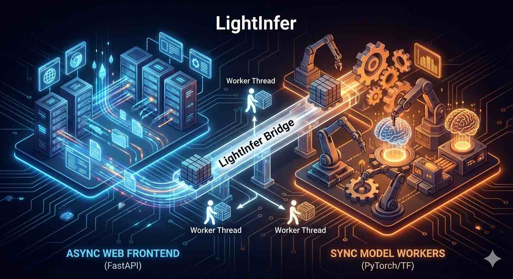

<div align="center">

  

  <br />

  <h1>⚡ LightInfer</h1>

  <p><strong>The Missing Bridge: Serve synchronous AI models via high-performance asynchronous FastAPI.</strong></p>

  <p align="center">
    <a href="https://pypi.org/project/lightinfer"></a>
    <a href="https://opensource.org/licenses/MIT"></a>
    
  </p>

  <p>
    <a href="README.md">English</a> | <a href="README.zh-CN.md">简体中文</a>
  </p>

</div>

---


## 🚀 Why LightInfer?

Are you struggling with the **"Blocking Loop" problem**?

Running heavy, synchronous model inference (like LLMs or diffusion models) directly inside an `async` web framework like FastAPI will freeze your entire server.

**LightInfer solves this instantly.** It acts as a high-performance bridge, efficiently isolating heavy computations in dedicated, managed worker threads while maintaining a fully asynchronous, high-concurrency web frontend.

### ✨ Key Features

* **🛡️ Zero-Blocking Architecture:**
    Seamlessly melds a high-concurrency **Async Web Frontend** with dedicated **Sync Worker Threads** for heavy lifting.
* **⚡ Efficient Bridge:**
    Utilizes a specialized `AsyncResponseBridge` for zero-thread-overhead waiting.
* **🌊 Advanced Streaming Support:**
    * **Native Server-Sent Events (SSE):** Perfect for LLM text generation.
    * **Binary Streaming:** Ideal for real-time audio/video generation (with chunk buffering).
* **🧩 Dead Simple Integration:**
    Just wrap *any* Python class with an `infer` method. We handle the rest.
* **🔒 Context Isolation:**
    Each worker runs in its own thread, ensuring thread-safety for libraries like PyTorch.

---

## 📦 Installation

Get started in seconds via pip:

```bash
pip install lightinfer
```

------

## ⚡ Quick Start

It takes just 3 steps to serve your model.

### 1. Define your Model

LightInfer wraps any class with an `infer` method. The arguments are automatically mapped from incoming JSON requests.

```Python
# my_model.py
import time

class MyModel:
    def infer(self, prompt: str = "world"):
        # Simulate heavy synchronous work (e.g., model inference)
        print(f"Processing: {prompt}...")
        time.sleep(1)
        return {"message": f"Hello, {prompt}!"}
```

### 2. Start the Server

Use the provided `LightServer` to spin up the API.

```Python
# server.py
from lightinfer.server import LightServer
from my_model import MyModel

# 1. Create your model instance
model = MyModel()

# 2. Start server (Pass a list of models to run multiple worker threads!)
# server = LightServer([model, model]) # <- Run 2 workers for higher throughput
server = LightServer([model])
server.start(port=8000)
```

Run it:

```Bash
python server.py
```

### 3. Make Requests

#### Standard Request (REST API)

```Python
import requests

# 'args' maps to positional arguments of infer()
# 'kwargs' maps to keyword arguments of infer()
payload = {"args": ["LightInfer User"]}

resp = requests.post("http://localhost:8000/api/v1/infer", json=payload)
print(resp.json())
# Output: {'message': 'Hello, LightInfer User!'}
```

#### 🌊 Streaming Request (SSE/Binary)

If your model uses `yield`, LightInfer automatically handles it as a stream.

**Model Side:**

```Python
import time

class StreamingModel:
    def infer(self, prompt: str):
        # Text streaming: yield strings directly
        # Binary streaming: yield bytes objects directly
        yield f"Start processing: {prompt}\n"
        time.sleep(0.5)
        yield "Generating Part 1...\n"
        time.sleep(0.5)
        yield "Generating Part 2... Done!"
```

**Client Side:** Adding `"stream": True` to your request payload tells the server to keep the connection open.

```Python
import requests

payload = {"args": ["test_stream"], "stream": True}

# Note: set stream=True in requests client as well
resp = requests.post("http://localhost:8000/api/v1/infer", json=payload, stream=True)

print("Receiving stream...")
for line in resp.iter_lines():
    if line:
        # Decode SSE format
        print(line.decode('utf-8'))
```

------

## 🖥️ CLI Usage

Serve any model class directly from your terminal without writing server code.

**Format:** `lightinfer <module_name>:<ClassName>`

```Bash
# Given my_model.py exists
lightinfer my_model:MyModel --port 8000 --workers 4
```

------

## 📂 Examples

Check the `examples/` directory in the repository for ready-to-run scenarios:

- **🤖 Simple LLM:** Text-to-Text generation with SSE streaming.
- **🗣️ Streaming TTS:** Text-to-Audio generation with binary chunk streaming.

------

## 🤝 Contributing

Contributions are welcome! Please feel free to submit a Pull Request.

------

## 📄 License

[MIT](https://www.google.com/search?q=LICENSE)
